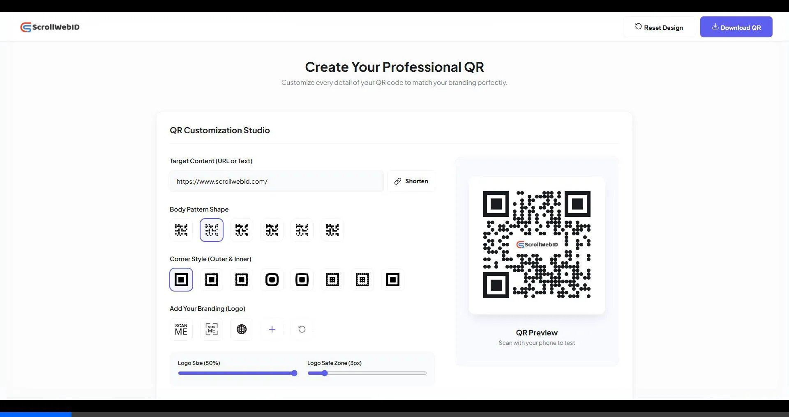

# QR Customization Studio

A modern, highly customizable Barcode & QR Code Generator built with React, Vite, and `qr-code-styling`. It allows you to create professional, high-definition QR codes with deep styling options.

## 📱 Interactive Demo


*(This is an animated WebP file demonstrating the responsive mobile layout and seamless QR code customization).*

---

## ✨ Features

- **High-Definition (HD) Download**: Generate and download 8x scale (up to 2400px resolution) QR codes without losing pixel quality.
- **Built-in URL Shortener**: Automatically shorten long, dense URLs into clean, easy-to-scan QR codes using a custom API integration (bypasses browser CORS).
- **Pro Design Controls**: 
  - **Outer Padding (Quiet Zone)**: Easily adjust the white margin surrounding the QR code (0px to 50px).
  - **Logo Safe Zone**: Change the scale of the embedded logo and dynamically carve out background dots so the logo is not obstructed.
- **Detailed Customizations**:
  - **6 Body Pattern Shapes**: Square, Dots, Rounded, Extra Rounded, Classy Rounded, Classy.
  - **8 Advanced Corner Styles**: Includes custom inner/outer frame combinations like Star, Diamond, Soft Square, and Smooth.
  - **Color Theming**: Support for custom foreground bounding and background colors with live debounced rendering for a smooth UI experience.
- **Fully Responsive**: Professionally stacked UI that seamlessly transitions from large desktop displays to mobile phones.

---

## 🚀 Installation 

Before you begin, ensure you have **Node.js** installed (v18 or higher is recommended).

1. **Clone or Download the Project**  
   Navigate to your desired directory and open your terminal.
   ```bash
   cd "d:\02.Project\Barcode Generator"
   ```

2. **Install Dependencies**  
   Run `npm install` to download all the necessary packages.
   ```bash
   npm install
   ```

3. **Start the Development Server**  
   Run the Vite development server.
   ```bash
   npm run dev
   ```

4. **Open in Browser**  
   The application will run locally. Click the link in your terminal, or go to:
   ```
   http://localhost:5173/
   ```

---

## 🛠️ Cara Pemakaian (Usage Guide)

1. **Masukkan URL / Teks**
   Buka aplikasi dan ketikkan alamat website (misal: `https://www.scrollwebid.com/`) ke dalam kolom teks **Target Content**.
  
2. **Gunakan URL Shortener (Opsional tapi Direkomendasikan)**
   Jika URL Anda terlalu panjang, klik tombol **"Shorten"**. Aplikasi akan langsung memperpendek link (via custom server-side proxy) sehingga QR code yang dihasilkan menjadi *less dense* (tidak terlalu padat) dan jauh lebih mudah di-scan oleh kamera HP.

3. **Pilih Desain (Body & Corner)**
   - Klik salah satu dari 6 ikon **Body Pattern Shape** untuk mengubah gaya titik QR.
   - Klik salah satu dari 8 ikon **Corner Style** untuk mendapatkan pinggiran QR yang disesuaikan dengan estetika brand Anda.

4. **Upload Brand Logo**
   - Aplikasi menggunakan logo bawaan (ScrollWebID).
   - Klik tombol **(+)** pada kotak Putih (*Add Your Branding*) untuk meng-upload logo usaha/pribadi Anda.
   - Gunakan slider **Logo Size** untuk memperbesar/memperkecil, dan slider **Logo Safe Zone** untuk memberikan jarak aman (ruang potong) pada titik QR di sekeliling logo.

5. **Sesuaikan Margin**
   Gunakan slider **Outer Padding (Quiet Zone)** untuk melebarkan kanvas QR Code. Mengatur padding ke `15px` - `25px` akan membantu agar QR terlihat profesional dan mudah dibaca oleh scanner.
   
6. **Ubah Warna**
   Klik kotak **Primary Color** atau **Background Color** untuk membuka *Color Picker*. Desain akan *update* secara langsung/live tanpa patah-patah (*no flickering*).

7. **Download HD**
   Setelah puas dengan tampilannya, klik tombol **"Download QR"** di sudut kanan atas.
   QR code akan diekspor dalam format PNG berkualitas sangat tinggi (HD) dan siap langsung dicetak untuk spanduk, banner, maupun brosur Anda.

---
*Built with ❤️ utilizing Vite & React.js*
